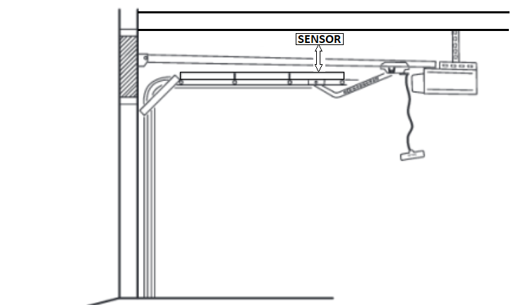
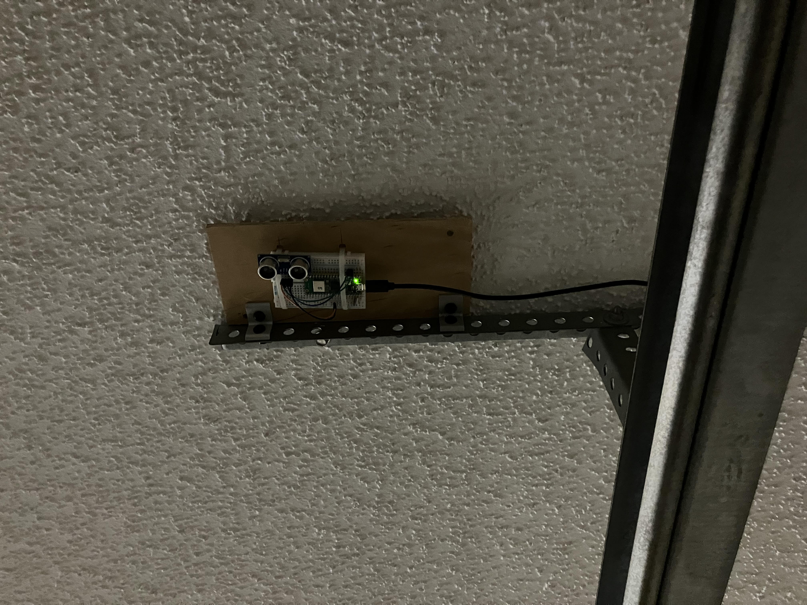

# Door Open Sensor & Monitor

## Here's the problem:

* In general, I try to keep the garage door closed except when it needs to be open.
* If I happen to be constantly going in and out (say I'm working in the yard), I leave it open.
* Occasionally, I will wake up in the morning and realize that I left the door open all night.
* Apparently, I need a reminder at the end of the day (before going to bed) that the garage door is open.

## Here's the solution: Using micropython programs on Raspberry Pi Pico-W microcontrollers

* A **distance sensor** detects the presence of the garage door in the open position
    * The sensor publishes the distance on a webserver
* A remotely located **monitor** periodically requests the distance value from the sensor
    * The monitor flashes its onboard LED either quickly or slowly:
        * Quickly if the door is open (The distance is below a threshold value)
        * Otherwise slowly (if closed)

## Unanticipated problems (RF Interference with garage door opener)

### Welcome to real life!

* As anyone who has ever impemented a simple solution to a simple problem realizes, Murphy's Law is there to remind us that we have overlooked something.
* My first solution used a **VL53LOX VCSEL sensor** to measure the distance to the garage door.
    * Problem was that when the VCSEL was running, my garage door receiver was not responsive to button presses from the remote radio transmitter.
    * Apparently, the VCSEL circuitry generates RFI at a frequency that interferes with the operation of the opener's radio signal.
* My next solution was to try a **TF-Mini optical Lidar** module that I happened to have laying around.
    * Same problem
* Eventually, I used the **HCSR04 ultrasonic distance sensor**.
    * It did the job and didn't generate RFI that interfered with the operation of the garage door opener radio signals.

